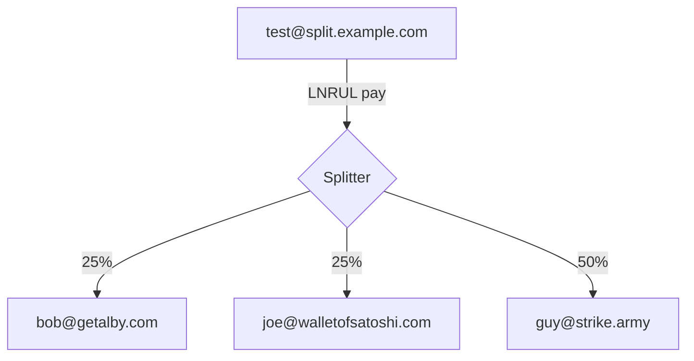

# LN-Address-Splitter




## Setting up a reverse proxy

For the lightning addresses and LNURL endpoints to work this app needs to be served at the root of a domain ( `https://example.com/` ) it wont work if its hosted at a sub path ( `https://example.com/splits` )

## Running from source

[NodeJS](https://nodejs.org/en) and [yarn](https://yarnpkg.com/) is required to build and run this app

If you dont have either setup [nvm](https://github.com/nvm-sh/nvm) is probably the easiest way to set them up

```bash
git clone https://github.com/hzrd149/ln-address-splitter.git
cd ln-address-splitter
# install dependencies
yarn install
yarn build
# copy the example config
cp .env.example .env
# edit the config
nano .env
# start the server
yarn start
```

## Running locally with a tunnelmole tunnel

`node development.mjs` will start a local development server and use [tunnelmole](https://tunnelmole.com/) to get a public facing domain

## Running with docker

```bash
docker run --rm -it \
	--name ln-address-splitter
	-p 3000:3000 \
	-v $(pwd)/data:/data \
	-e DB_PATH=/data/splits.json \
	-e LNBITS_URL="https://legend.lnbits.com" \
	-e WALLET_ID="<lnbits wallet id>" \
	-e ADMIN_KEY="<lnbits admin key>" \
	-e LOGIN_USER=admin \
	-e LOGIN_PASSWORD=changeme \
	ghcr.io/hzrd149/ln-address-splitter
```

Then you can open [http://localhost:3000/admin](http://localhost:3000/admin)

## Docker compose

See the [docker-compose.yaml](./docker-compose.yaml) for an example
