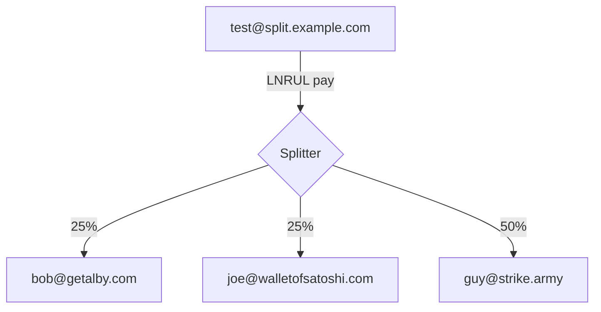

# LN-Address-Splitter




## Public access

For the lightning addresses and the LNURL endpoints to work the app needs to be publicly accessible and served over https

## Configuration

All configuration is done through environment variables

- `DB_PATH` the path to the json file where data will be stored (default `./splits.json`)
- `PORT` http server port (default `3000`)
- `LNBITS_URL` URL to the lnbits instance ( this can be a local address, eg `http://192.168.1.100:8000` or `http://umbrel.local:3007` )
- `WALLET_ID` The id of the lnbits wallet
- `ADMIN_KEY` The admin key for the wallet, used to create and pay invoices
- `LOGIN_USER` The username for the `/admin` dashboard (default `admin`)
- `LOGIN_PASSWORD` The password for the `/admin` (if its not set then the `/admin` routes will be publicly accessible)

## Running from source

[NodeJS](https://nodejs.org/en) and [yarn](https://yarnpkg.com/) are required to build and run the app

If you dont have either installing via [nvm](https://github.com/nvm-sh/nvm) is probably the easiest way to set them up

```bash
git clone https://github.com/hzrd149/ln-address-splitter.git
cd ln-address-splitter
# install dependencies
yarn install
yarn build
# copy the example config
cp .env.example .env
# edit the config
nano .env
# start the server
yarn start
```

## Running locally with a tunnelmole tunnel

`node development.mjs` will start a local development server and use [tunnelmole](https://tunnelmole.com/) to get a public facing domain with https

## Running with docker

```bash
docker run --rm -it \
	--name ln-address-splitter
	-p 3000:3000 \
	-v $(pwd)/data:/data \
	-e DB_PATH=/data/splits.json \
	-e LNBITS_URL="https://legend.lnbits.com" \
	-e WALLET_ID="<lnbits wallet id>" \
	-e ADMIN_KEY="<lnbits admin key>" \
	-e LOGIN_USER=admin \
	-e LOGIN_PASSWORD=changeme \
	ghcr.io/hzrd149/ln-address-splitter
```

Then you can open [http://localhost:3000/admin](http://localhost:3000/admin)

## Docker compose

See the [docker-compose.yaml](./docker-compose.yaml) for an example
